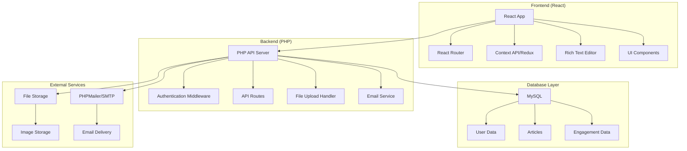
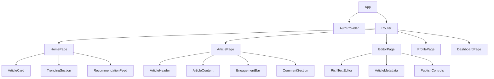

# Design Document

## Overview

The Medium-style publishing platform will be built as a modern web application using React for the frontend and PHP for the backend, with MySQL as the primary database. The architecture follows a RESTful API design with JWT-based authentication, ensuring scalability and maintainability.

The platform emphasizes clean, distraction-free reading experiences while providing powerful content creation tools. The design prioritizes performance, accessibility, and responsive design across all devices.

## Architecture

### System Architecture



### Technology Stack

**Frontend:**
- React 18 with TypeScript for type safety
- React Router v6 for client-side routing
- Context API with useReducer for state management
- Tailwind CSS for styling and responsive design
- TipTap or Draft.js for rich text editing
- Axios for HTTP requests
- React Query for server state management

**Backend:**
- PHP 8.1+ with modern OOP practices
- Composer for dependency management
- JWT for authentication (firebase/php-jwt)
- File upload handling with validation
- PHPMailer for email services
- password_hash() for secure password hashing
- CORS and security headers implementation

**Database:**
- MySQL 8.0+ for primary data storage
- PDO with prepared statements for security
- phpMyAdmin for database administration and management
- Manual database setup and table creation via phpMyAdmin interface
- SQL scripts executed through phpMyAdmin for initial setup

**Infrastructure:**
- Local file storage or cloud storage for images
- Standard web hosting with PHP support
- Environment-based configuration with .env files
- Apache/Nginx web server configuration

## Components and Interfaces

### Frontend Component Architecture



### Key Frontend Components

**1. RichTextEditor Component**
- Built with TipTap for extensibility
- Custom toolbar with Medium-style formatting
- Auto-save functionality every 30 seconds
- Image upload with drag-and-drop
- Code syntax highlighting
- Word count and reading time estimation

**2. ArticleCard Component**
- Responsive card layout
- Author information with avatar
- Article preview with truncated content
- Engagement metrics (claps, comments)
- Tag display and filtering

**3. EngagementBar Component**
- Clap button with animation (up to 50 claps)
- Comment toggle
- Bookmark functionality
- Social sharing options
- Follow author button

**4. CommentSection Component**
- Nested comment threading (3 levels deep)
- Real-time comment updates
- Edit/delete functionality for own comments
- Comment moderation for authors

### Backend API Design

**PHP API Structure:**
- `/api/index.php` - Main API router
- `/api/config/` - Database and configuration files
- `/api/controllers/` - Business logic controllers
- `/api/models/` - Data access layer
- `/api/middleware/` - Authentication and validation
- `/api/utils/` - Helper functions and utilities

**Authentication Endpoints:**
```
POST /api/auth/register.php
POST /api/auth/login.php
POST /api/auth/refresh.php
POST /api/auth/logout.php
POST /api/auth/forgot-password.php
POST /api/auth/reset-password.php
```

**User Management:**
```
GET /api/users/profile.php?id=:id
PUT /api/users/profile.php
POST /api/users/upload-avatar.php
GET /api/users/articles.php?id=:id
POST /api/users/follow.php
DELETE /api/users/follow.php
```

**Article Management:**
```
GET /api/articles/index.php
POST /api/articles/create.php
GET /api/articles/show.php?id=:id
PUT /api/articles/update.php
DELETE /api/articles/delete.php
POST /api/articles/clap.php
GET /api/articles/comments.php?id=:id
POST /api/articles/comment.php
```

**Content Discovery:**
```
GET /api/search/index.php?q=query&filters={}
GET /api/articles/trending.php
GET /api/articles/recommended.php
GET /api/tags/index.php
GET /api/tags/articles.php?slug=:slug
```

**Publications Management:**
```
GET /api/publications/index.php
POST /api/publications/create.php
GET /api/publications/show.php?id=:id
PUT /api/publications/update.php
POST /api/publications/invite.php
GET /api/publications/members.php?id=:id
```

### API Response Format

**Standard Response Structure:**
```json
{
  "success": true,
  "data": {
    // Response data
  },
  "message": "Success message",
  "pagination": {
    "current_page": 1,
    "total_pages": 10,
    "total_items": 100,
    "per_page": 10
  }
}
```

**Error Response Structure:**
```json
{
  "success": false,
  "error": {
    "code": "VALIDATION_ERROR",
    "message": "Invalid input data",
    "details": {
      "email": ["Email is required"],
      "password": ["Password must be at least 8 characters"]
    }
  }
}
```

## Data Models

### Database Schema

**Users Table:**
```sql
CREATE TABLE users (
    id INT AUTO_INCREMENT PRIMARY KEY,
    username VARCHAR(50) UNIQUE NOT NULL,
    email VARCHAR(255) UNIQUE NOT NULL,
    password_hash VARCHAR(255) NOT NULL,
    bio TEXT,
    profile_image_url VARCHAR(500),
    social_links JSON,
    email_verified BOOLEAN DEFAULT FALSE,
    created_at TIMESTAMP DEFAULT CURRENT_TIMESTAMP,
    updated_at TIMESTAMP DEFAULT CURRENT_TIMESTAMP ON UPDATE CURRENT_TIMESTAMP
);
```

**Articles Table:**
```sql
CREATE TABLE articles (
    id INT AUTO_INCREMENT PRIMARY KEY,
    author_id INT NOT NULL,
    publication_id INT NULL,
    title VARCHAR(255) NOT NULL,
    subtitle VARCHAR(500),
    content JSON NOT NULL, -- Rich text content as JSON
    featured_image_url VARCHAR(500),
    status ENUM('draft', 'published', 'archived') DEFAULT 'draft',
    published_at TIMESTAMP NULL,
    reading_time INT DEFAULT 0, -- in minutes
    view_count INT DEFAULT 0,
    clap_count INT DEFAULT 0,
    comment_count INT DEFAULT 0,
    created_at TIMESTAMP DEFAULT CURRENT_TIMESTAMP,
    updated_at TIMESTAMP DEFAULT CURRENT_TIMESTAMP ON UPDATE CURRENT_TIMESTAMP,
    FOREIGN KEY (author_id) REFERENCES users(id) ON DELETE CASCADE,
    FOREIGN KEY (publication_id) REFERENCES publications(id) ON DELETE SET NULL
);
```

**Tags and Relationships:**
```sql
CREATE TABLE tags (
    id INT AUTO_INCREMENT PRIMARY KEY,
    name VARCHAR(50) UNIQUE NOT NULL,
    slug VARCHAR(50) UNIQUE NOT NULL,
    description TEXT,
    created_at TIMESTAMP DEFAULT CURRENT_TIMESTAMP
);

CREATE TABLE article_tags (
    article_id INT NOT NULL,
    tag_id INT NOT NULL,
    PRIMARY KEY (article_id, tag_id),
    FOREIGN KEY (article_id) REFERENCES articles(id) ON DELETE CASCADE,
    FOREIGN KEY (tag_id) REFERENCES tags(id) ON DELETE CASCADE
);
```

**Engagement Tables:**
```sql
CREATE TABLE claps (
    id INT AUTO_INCREMENT PRIMARY KEY,
    user_id INT NOT NULL,
    article_id INT NOT NULL,
    count INT DEFAULT 1 CHECK (count <= 50),
    created_at TIMESTAMP DEFAULT CURRENT_TIMESTAMP,
    UNIQUE KEY unique_user_article (user_id, article_id),
    FOREIGN KEY (user_id) REFERENCES users(id) ON DELETE CASCADE,
    FOREIGN KEY (article_id) REFERENCES articles(id) ON DELETE CASCADE
);

CREATE TABLE comments (
    id INT AUTO_INCREMENT PRIMARY KEY,
    article_id INT NOT NULL,
    user_id INT NOT NULL,
    parent_comment_id INT NULL,
    content TEXT NOT NULL,
    created_at TIMESTAMP DEFAULT CURRENT_TIMESTAMP,
    updated_at TIMESTAMP DEFAULT CURRENT_TIMESTAMP ON UPDATE CURRENT_TIMESTAMP,
    FOREIGN KEY (article_id) REFERENCES articles(id) ON DELETE CASCADE,
    FOREIGN KEY (user_id) REFERENCES users(id) ON DELETE CASCADE,
    FOREIGN KEY (parent_comment_id) REFERENCES comments(id) ON DELETE CASCADE
);

CREATE TABLE bookmarks (
    user_id INT NOT NULL,
    article_id INT NOT NULL,
    created_at TIMESTAMP DEFAULT CURRENT_TIMESTAMP,
    PRIMARY KEY (user_id, article_id),
    FOREIGN KEY (user_id) REFERENCES users(id) ON DELETE CASCADE,
    FOREIGN KEY (article_id) REFERENCES articles(id) ON DELETE CASCADE
);

CREATE TABLE follows (
    follower_id INT NOT NULL,
    following_id INT NOT NULL,
    created_at TIMESTAMP DEFAULT CURRENT_TIMESTAMP,
    PRIMARY KEY (follower_id, following_id),
    FOREIGN KEY (follower_id) REFERENCES users(id) ON DELETE CASCADE,
    FOREIGN KEY (following_id) REFERENCES users(id) ON DELETE CASCADE,
    CHECK (follower_id != following_id)
);
```

**Publications and Additional Tables:**
```sql
CREATE TABLE publications (
    id INT AUTO_INCREMENT PRIMARY KEY,
    name VARCHAR(100) NOT NULL,
    description TEXT,
    logo_url VARCHAR(500),
    owner_id INT NOT NULL,
    created_at TIMESTAMP DEFAULT CURRENT_TIMESTAMP,
    updated_at TIMESTAMP DEFAULT CURRENT_TIMESTAMP ON UPDATE CURRENT_TIMESTAMP,
    FOREIGN KEY (owner_id) REFERENCES users(id) ON DELETE CASCADE
);

CREATE TABLE publication_members (
    publication_id INT NOT NULL,
    user_id INT NOT NULL,
    role ENUM('admin', 'editor', 'writer') DEFAULT 'writer',
    created_at TIMESTAMP DEFAULT CURRENT_TIMESTAMP,
    PRIMARY KEY (publication_id, user_id),
    FOREIGN KEY (publication_id) REFERENCES publications(id) ON DELETE CASCADE,
    FOREIGN KEY (user_id) REFERENCES users(id) ON DELETE CASCADE
);

CREATE TABLE notifications (
    id INT AUTO_INCREMENT PRIMARY KEY,
    user_id INT NOT NULL,
    type ENUM('follow', 'clap', 'comment', 'publication_invite') NOT NULL,
    content TEXT NOT NULL,
    related_id INT, -- Can reference article_id, user_id, etc.
    is_read BOOLEAN DEFAULT FALSE,
    created_at TIMESTAMP DEFAULT CURRENT_TIMESTAMP,
    FOREIGN KEY (user_id) REFERENCES users(id) ON DELETE CASCADE
);

CREATE TABLE password_resets (
    id INT AUTO_INCREMENT PRIMARY KEY,
    email VARCHAR(255) NOT NULL,
    token VARCHAR(255) NOT NULL,
    expires_at TIMESTAMP NOT NULL,
    created_at TIMESTAMP DEFAULT CURRENT_TIMESTAMP,
    INDEX idx_email (email),
    INDEX idx_token (token)
);
```

### Data Access Layer

**PHP Class Structure:**
```php
// Database connection singleton
class Database {
    private static $instance = null;
    private $pdo;
    
    public static function getInstance() {
        if (self::$instance === null) {
            self::$instance = new self();
        }
        return self::$instance;
    }
    
    private function __construct() {
        $dsn = "mysql:host=" . DB_HOST . ";dbname=" . DB_NAME . ";charset=utf8mb4";
        $this->pdo = new PDO($dsn, DB_USER, DB_PASS, [
            PDO::ATTR_ERRMODE => PDO::ERRMODE_EXCEPTION,
            PDO::ATTR_DEFAULT_FETCH_MODE => PDO::FETCH_ASSOC,
            PDO::ATTR_EMULATE_PREPARES => false
        ]);
    }
}

// Base repository class
abstract class BaseRepository {
    protected $db;
    protected $table;
    
    public function __construct() {
        $this->db = Database::getInstance()->getConnection();
    }
}
```

**Repository Pattern Implementation:**
- `UserRepository` for user operations and authentication
- `ArticleRepository` for article CRUD and publishing
- `EngagementRepository` for claps, comments, bookmarks
- `SearchRepository` for content discovery and filtering
- `NotificationRepository` for user notifications
- `TagRepository` for tag management and relationships

**Caching Strategy:**
- File-based caching for frequently accessed articles
- Session-based user data caching
- MySQL query caching optimization
- Static file caching for images and assets

### PHP Backend Structure

**Directory Structure:**
```
/api
├── config/
│   ├── database.php
│   ├── config.php
│   └── cors.php
├── controllers/
│   ├── AuthController.php
│   ├── UserController.php
│   ├── ArticleController.php
│   ├── CommentController.php
│   └── SearchController.php
├── models/
│   ├── User.php
│   ├── Article.php
│   ├── Comment.php
│   ├── Tag.php
│   └── Publication.php
├── middleware/
│   ├── AuthMiddleware.php
│   ├── CorsMiddleware.php
│   └── ValidationMiddleware.php
├── utils/
│   ├── JWTHelper.php
│   ├── FileUpload.php
│   ├── EmailSender.php
│   └── Validator.php
├── routes/
│   ├── auth.php
│   ├── users.php
│   ├── articles.php
│   └── search.php
└── index.php
```

**Core PHP Classes:**

**JWT Authentication:**
```php
class JWTHelper {
    private static $secret_key = "your-secret-key";
    
    public static function encode($payload) {
        return JWT::encode($payload, self::$secret_key, 'HS256');
    }
    
    public static function decode($jwt) {
        return JWT::decode($jwt, new Key(self::$secret_key, 'HS256'));
    }
}
```

**File Upload Handler:**
```php
class FileUpload {
    private $allowedTypes = ['image/jpeg', 'image/png', 'image/gif'];
    private $maxSize = 5 * 1024 * 1024; // 5MB
    
    public function uploadImage($file, $directory = 'uploads/') {
        // Validate file type and size
        // Generate unique filename
        // Move file to destination
        // Return file URL
    }
}
```

## Error Handling

### Frontend Error Handling

**Error Boundary Implementation:**
```typescript
interface ErrorBoundaryState {
  hasError: boolean;
  error?: Error;
}

class ErrorBoundary extends Component<Props, ErrorBoundaryState> {
  // Catch JavaScript errors anywhere in component tree
  // Display fallback UI with error reporting
  // Log errors to monitoring service
}
```

**API Error Handling:**
- Axios interceptors for global error handling
- Toast notifications for user-facing errors
- Retry logic for network failures
- Graceful degradation for non-critical features

### Backend Error Handling

**PHP Error Handling:**
```php
class ErrorHandler {
    public static function handleException($exception) {
        error_log($exception->getMessage());
        
        http_response_code(500);
        echo json_encode([
            'error' => 'Internal server error',
            'message' => $exception->getMessage()
        ]);
    }
    
    public static function handleError($errno, $errstr, $errfile, $errline) {
        throw new ErrorException($errstr, 0, $errno, $errfile, $errline);
    }
}

set_exception_handler(['ErrorHandler', 'handleException']);
set_error_handler(['ErrorHandler', 'handleError']);
```

**Validation and Security:**
- Input validation with filter_var() and custom validators
- PDO prepared statements for SQL injection prevention
- File upload validation (MIME type, size, extension checking)
- Rate limiting with session-based counters
- CSRF token validation for state-changing operations

## Testing Strategy

### Frontend Testing

**Unit Testing:**
- Jest and React Testing Library for component tests
- Test user interactions and state changes
- Mock API calls and external dependencies
- Accessibility testing with jest-axe

**Integration Testing:**
- Test complete user workflows
- API integration testing
- Cross-browser compatibility testing
- Performance testing with Lighthouse

**E2E Testing:**
- Playwright or Cypress for end-to-end scenarios
- Critical user journeys (registration, article creation, publishing)
- Mobile responsiveness testing
- SEO and metadata validation

### Backend Testing

**PHP Unit Testing:**
- PHPUnit for business logic and class testing
- Database operation testing with test database
- Authentication and authorization testing
- File upload and processing testing
- Mock objects for external dependencies

**API Testing:**
- Postman/Insomnia for manual API testing
- PHPUnit for automated endpoint testing
- Authentication flow testing with JWT validation
- Input validation and sanitization testing
- Error response verification

**Performance Testing:**
- Apache Bench (ab) for load testing
- MySQL query optimization with EXPLAIN
- PHP profiling with Xdebug
- Memory usage monitoring
- Response time optimization

### Security Testing

**Security Measures:**
- SQL injection prevention with parameterized queries
- XSS protection with content sanitization
- CSRF protection with tokens
- Rate limiting and DDoS protection
- File upload security scanning
- JWT token security and rotation
- HTTPS enforcement and security headers

**Penetration Testing:**
- Regular security audits
- Dependency vulnerability scanning
- Authentication bypass testing
- Authorization testing for all endpoints

## SEO and Performance Optimization

### SEO Strategy

**Meta Tags and Open Graph:**
- Dynamic meta titles and descriptions for articles
- Open Graph tags for social media sharing
- Twitter Card implementation
- Canonical URLs for duplicate content prevention
- Structured data markup (JSON-LD) for articles

**URL Structure:**
- SEO-friendly URLs: `/article/article-title-slug`
- User profiles: `/user/username`
- Tag pages: `/tag/tag-name`
- Publication pages: `/publication/publication-name`

**Sitemap Generation:**
- Dynamic XML sitemap generation
- Article sitemap with publication dates
- User and tag sitemaps
- Automatic sitemap updates

### Performance Optimization

**Frontend Performance:**
- Code splitting and lazy loading
- Image optimization and lazy loading
- CSS and JavaScript minification
- Browser caching strategies
- Service worker for offline functionality

**Backend Performance:**
- Database query optimization
- Proper indexing on frequently queried columns
- Connection pooling
- Response compression (gzip)
- CDN integration for static assets

**Database Indexing:**
```sql
-- Performance indexes
CREATE INDEX idx_articles_author_status ON articles(author_id, status);
CREATE INDEX idx_articles_published_at ON articles(published_at DESC);
CREATE INDEX idx_comments_article_id ON comments(article_id);
CREATE INDEX idx_claps_article_user ON claps(article_id, user_id);
CREATE FULLTEXT INDEX idx_articles_search ON articles(title, subtitle, content);
CREATE INDEX idx_tags_name ON tags(name);
```

## Deployment and Configuration

### Environment Configuration

**Environment Variables (.env):**
```
DB_HOST=localhost
DB_NAME=medium_clone
DB_USER=username
DB_PASS=password
JWT_SECRET=your-jwt-secret-key
UPLOAD_PATH=/uploads/
MAX_UPLOAD_SIZE=5242880
SMTP_HOST=smtp.gmail.com
SMTP_PORT=587
SMTP_USER=your-email@gmail.com
SMTP_PASS=your-app-password
```

### Apache Configuration

**.htaccess for API routing:**
```apache
RewriteEngine On
RewriteCond %{REQUEST_FILENAME} !-f
RewriteCond %{REQUEST_FILENAME} !-d
RewriteRule ^api/(.*)$ api/index.php [QSA,L]

# CORS headers
Header always set Access-Control-Allow-Origin "*"
Header always set Access-Control-Allow-Methods "GET, POST, PUT, DELETE, OPTIONS"
Header always set Access-Control-Allow-Headers "Content-Type, Authorization"
```